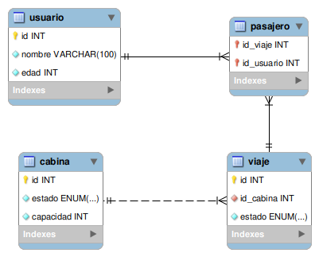

<p align="center"></p>

<h1 align="center">'·. 🌬️ Teleférico LWD 🚠 .·'</h1>
<p align="center"><i><b>L</b>ong <b>W</b>ay <b>D</b>own</i></p>
<p>En este apartado se hablará de las características del sistema, su funcionalidad y finalmente las distintas pruebas realizadas con el fin de solucionar errores de haberlos.</p>

## Índice
- [En proceso...]()

------

<h2>Base de datos</h2>
<p>Para la base que será utlizada para el aplicativo, se hizo uso de las siguientes tecnologías:</p>

- [Draw.io](https://app.diagrams.net/): Para la creación de los distintos diagramas.
- MySQL Workbench: Para la creación y ejecución del código de la base datos, adicionalmente la generación del diagrama UML.
<p>Se realizaron los siguientes modelos para su construcción.</p>

<h3>Modelo Conceptual</h3>
<p>Para la construcción del modelo conceptual, se tuvo en cuenta lo proporcionado en los requerimientos como punto de partida.</p>
<p align="center"></p>

<h3>Modelo E-R</h3>
<p>Para la construcción del modelo Entidad-Relación, se tuvo en cuenta el anterior diagrama y transformarlo en tablas, con sus atributos organizados de manera vertical.</p>
<p align="center"></p>

<h3>Normalización</h3>
<p>Para el proceso de normalización se realizan las respectivas modificaciones para eliminar la redundancia que se pudo haber presentando con las tablas presentadas anteriormente.</p>
<p align="center"></p>

<h3>Modelo Físico</h3>
<p>Para la creación de este modelo se tuvo en cuenta la última forma de normalización realizada para cada una de las tablas que serán implementadas en la base de datos. Además, a partir de las especificaciones en los requerimientos, se elije el tipo de dato necesario para los atributos mencionados.</p>

```sql
-- Tabla para Cabinas
create table cabina(
	id int not null auto_increment primary key,
    estado enum("En movimiento","Detenida") not null,
    capacidad int not null
);

-- Tabla para Usuarios
create table usuario(
	id int not null auto_increment primary key,
    nombre varchar(100) not null,
    edad int not null
);

-- Tabla para Viajes en teleferico
create table viaje(
	id int not null auto_increment primary key,
    id_cabina int not null,
    foreign key(id_cabina)references cabina(id),
    estado enum("Pendiente","En curso","Finalizado") not null
);

-- Tabla para Pasajeros de viajes
create table pasajero(
	id_viaje int not null,
    foreign key(id_viaje)references viaje(id),
    id_usuario int not null,
    foreign key(id_usuario)references usuario(id),
	primary key(id_viaje,id_usuario)
);
```

<h3>Modelo UML</h3>
<p>Una vez completado el anterior modelo, se ejecuta la opción Reverse Engineer en el apartado de Database en MySQL Workbench. Dando como resulta el siguiente diagrama:</p>
<p align="center"></p>

------

<h2>Sistema</h2>
<p>Para el desarrolo del sistema del aplicativo, se hizo uso de las siguientes tecnologías:</p>

- IntelliJ IDEA: Como entorno de desarrollo para Java.
- Java: Como el lenguaje que será utilizado para el desarrollo del aplicativo.
